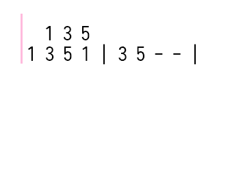

[简体中文](SYNTAX_cn.md) - [English](SYNTAX.md)

# Syntax
DoMiSo's numbered musical notation format includes `control commands` and `note markers`.  
The control commands include `key control`, `tempo control` and `rollback control`.

## Control commands ##

> [!WARNING]  
> Due to restrictions in the game itself, it is not possible to play chromatic tones, so in this special edition, unplayable tones will be automatically ignored when played.

### key control

`1=F#`

When no scale number is added, the default is the 5th scale. I.e. the above command is equivalent to

`1=F5#`

Default `1=C` when no tonality is specified


### tempo control

`bpm=120`

Valid bpm ranges from `1` to `480`, values outside this range are considered invalid and will reset bpm to the initial value of `80`.

When no tempo is specified, the default is `bpm=80`.

### rollback control

`rollback=12.5`

The function of the Rollback command is to move the writing position of a note forward by `N` full note lengths at the current tempo. `N` can be a decimal number.

When there are multiple parts, this command can be used to write multiple parts separately. Its use will be described later.

All control commands are case-insensitive and can be placed on the same line as the note. The command will be executed before the note is parsed, regardless of its position on the line.

## note ##

### Examples ###

`++3b//` `-1#-/-` `5..` `( 1 3 5 )`

Each note is separated by a space and notes that do not meet the format are simply ignored.

### Pitch ###

The notes are marked from `0 to 7`, with the same meaning as in numbered musical notation.

The notes preceded by `+` and `-` indicate that the note is raised or lowered by N steps, N being the number of `+` or `-`.

The `#` and `b` after the note indicate that the note is raised or lowered by half tone.

### Time ###

The time-related markers are `/` `-` `. `

`/` means that the time of the preceding mark is reduced by half. The meaning is the same as the underscore in numbered musical notation.

`-` indicates the time of a whole note. The meaning is the same as in numbered musical notation. Can be used in combination with `/`.

`.` extends the time of the preceding note by half.

For example, `5..` has a note time of `1+0.5+0.25` beats.

`++3b//` has a note time of `0.25` beats.

`-1#-/-` has a note time of `1+0.5+1` beats.

`( 1 3- 5 )` has a note time of `2` beats. This is a chord. The use of the chord is described below.
### Chords ###

Notes enclosed in parentheses are considered chords. There must be a space between the parentheses and the notes; otherwise, they will be treated as invalid notes and ignored.

Each note in the chord will be played simultaneously, and the base duration of the chord is determined by the longest note within the chord.

Starting from version `v0.99.9`, chords can also support duration markers, for example:
- `( 1 3/ 5 )/` represents a chord with a duration of `0.5` beats
- `( 1 3 5 )--` represents a chord with a duration of `3` beats
- `( 1 3 5 )..` represents a chord with a duration of `1.75` beats

The duration marker of a chord affects the base duration of the chord. For example:
- `( 1/ 3// 5/ )` is a chord with a base duration of `0.5` beats, so `( 1/ 3// 5/ )/` has a duration of `0.25` beats

### Tuplets ###

Similar to chords, notes enclosed in curly braces `{}` represent tuplets. The notes within the curly braces will automatically be divided equally into the assigned duration, with the total duration of the notes within the curly braces being `1` beat. For example:
- `{ 1 3 5 }` represents a triplet with a total duration of `1` beat
- `{ 1 3 5 6 +3 }` represents a quintuplet with a total duration of `1` beat

The length of each note within the curly braces only affects its allocated duration. For example:
- `{ 1 3 5 +1 }` = `1// 3// 5// +1//` = `{ 1/ 3/ 5/ +1/ }`
- `{ 1 3/ 5 +1/ +5 }` = `1// 3/// 5// +1/// +5//` = `{ 1/ 3// 5/ +1// +5/ }`

Just like chords, tuplets enclosed in curly braces also support duration markers. For example:
- `{ 1 3 5 +1 }/` = `1/// 3/// 5/// +1///`

### Arpeggios ###
`1-- ~3-- ~5-- ~6-- ~7-- ~+5-- ~+7--`

As shown in the example above, you can write arpeggios using a tilde `~`.

Adding `~` before a note indicates that this note will be played slightly delayed relative to the previous note, but its end time will remain the same as if it were not delayed.

For example, in the example above, all notes will end simultaneously on the `3` beat.

> [!NOTE]  
> Since the arpeggio marker is an offset relative to the previous note, it cannot be used on the first note.

## RollBack
This is a RollBack usage example to demonstrate the basic usage of the RollBack command.

This is written using the chord:

```
    ( 1 -1 ) ( 2 -2 ) ( 3 -3 ) ( 4 -4 ) ( 5 -5 ) ( 6 -6 ) ( 7 -7 )
```

This is written using rollback command：

```
    1 2 3 4 5 6 7
    rollback=7
    -1 -2 -3 -4 -5 -6 -7
```

Rollback command animation demonstration：



The effect is the same for both ways of writing. More usage can be found in the sample sketches in the `example_sheets` directory.
